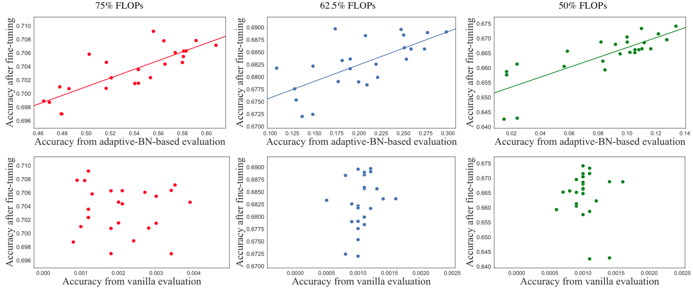

# EagleEye: Fast Sub-net Evaluation for Efficient Neural Network Pruning


PyTorch implementation for *[EagleEye: Fast Sub-net Evaluation for Efficient Neural Network Pruning](https://arxiv.org/abs/2007.02491)*

[Bailin Li,](https://github.com/bezorro) [Bowen Wu](https://github.com/Bowenwu1), Jiang Su, [Guangrun Wang](https://wanggrun.github.io/projects/zw), [Liang Lin](http://www.linliang.net/)

Presented at [ECCV 2020 (Oral)](https://eccv2020.eu/accepted-papers/)


## Citation

If you use EagleEye in your research, please consider citing:

```
@misc{li2020eagleeye,
    title={EagleEye: Fast Sub-net Evaluation for Efficient Neural Network Pruning},
    author={Bailin Li and Bowen Wu and Jiang Su and Guangrun Wang and Liang Lin},
    year={2020},
    eprint={2007.02491},
    archivePrefix={arXiv},
    primaryClass={cs.CV}
}
```

## Code Release Schedule

- [x] Inference Code
- [ ] Pruning Strategy Generation
- [ ] Adaptive-BN-based Candidate Evaluation of Pruning Strategy
- [ ] Finetuning of Pruned Model

## Adaptive-BN-based Candidate Evaluation

For the ease of your own implementation, here we present the key code for proposed Adaptive-BN-based Candidate Evaluation. The official implementation will be released soon.

```python
def eval_pruning_strategy(model, pruning_strategy, dataloader_train):
   # Apply filter pruning to trained model
   pruned_model = prune(model, pruning_strategy)

   # Adaptive-BN
   pruned_model.train()
   max_iter = 50
   with torch.no_grad():
      for iter_in_epoch, sample in enumerate(dataloader_train):
            pruned_model.forward(sample)
            if iter_in_epoch > max_iter:
                break

   # Eval top-1 accuracy for pruned model
   acc = pruned_model.get_val_acc()
   return acc
```

## Setup

1. **Prepare Data**

   Download `ILSVRC2012` dataset from http://image-net.org/challenges/LSVRC/2012/index#introduction

2. **Download Pretrained Models**

   We provide reported pruned models in [Dropbox](<https://www.dropbox.com/sh/im1janxv5p8u5jm/AAA7s6danrqdL42UvteICARra?dl=0>). Please put the downloaded models in the dir of `models/ckpt/`.

3. **Prepare Runtime Environment**

   ```shell
   pip install -r requirements.txt
   ```

## Usage

```shell
usage: main.py [-h] [--model_name MODEL_NAME] [--num_classes NUM_CLASSES]
               [--checkpoint CHECKPOINT] [--gpu_ids GPU_IDS [GPU_IDS ...]]
               [--batch_size BATCH_SIZE] [--dataset_path DATASET_PATH]
               [--dataset_name DATASET_NAME] [--num_workers NUM_WORKERS]
               [--lr LR] [--weight_decay WEIGHT_DECAY] [--momentum MOMENTUM]
               [--max_rate MAX_RATE] [--affine AFFINE]
               [--compress_schedule_path COMPRESS_SCHEDULE_PATH]
               [--flops_target FLOPS_TARGET] [--output_file OUTPUT_FILE]

optional arguments:
  -h, --help            show this help message and exit
  --model_name MODEL_NAME
                        what kind of model you are using. Only support
                        `resnet50`, `mobilenetv1` and `mobilenetv1_imagenet`
  --num_classes NUM_CLASSES
                        num of class label
  --checkpoint CHECKPOINT
                        path to model state dict
  --gpu_ids GPU_IDS [GPU_IDS ...]
                        GPU ids.
  --batch_size BATCH_SIZE
                        batch size while fine-tuning
  --dataset_path DATASET_PATH
                        path to dataset
  --dataset_name DATASET_NAME
                        filename of the file contains your own
                        `get_dataloaders` function
  --num_workers NUM_WORKERS
                        Number of workers used in dataloading
  --lr LR               learning rate while fine-tuning
  --weight_decay WEIGHT_DECAY
                        weight decay while fine-tuning
  --momentum MOMENTUM   momentum while fine-tuning
  --max_rate MAX_RATE   define search space
  --affine AFFINE       define search space
  --compress_schedule_path COMPRESS_SCHEDULE_PATH
                        path to compression schedule
  --flops_target FLOPS_TARGET
                        flops constraints for pruning
  --output_file OUTPUT_FILE
                        path to compression schedule
```

### Adaptive-BN-based Searching for Pruning Strategy

```shell
python3 search.py \
--model_name mobilenetv1 \
--num_classes 1000 \
--checkpoint models/ckpt/imagenet_mobilenet_726.pth \
--gpu_ids 5 \
--batch_size 128 \
--dataset_path /data/imagenet \
--dataset_name imagenet_train_val_split \
--num_workers 4 \
--flops_target 0.5 \
--max_rate 0.7 \
--affine 0 \
--flops_target 0.5 \
--output_file log.txt \
--compress_schedule_path {compress_config/mbv1_imagenet.yaml|/compress_config/res50_imagenet.yaml}

```

### Inference of Pruned Model

**For ResNet50:**

```shell
python3 main.py \
--model_name resnet50 \
--num_classes 1000 \
--checkpoint models/ckpt/{resnet50_25flops.pth|resnet50_50flops.pth|resnet50_72flops.pth} \
--gpu_ids 4 \
--batch_size 512 \
--dataset_path {PATH_TO_IMAGENET} \
--dataset_name imagenet \
--num_workers 20
```

**For MobileNetV1:**

```shell
python3 main.py \
--model_name mobilenetv1 \
--num_classes 1000 \
--checkpoint models/ckpt/mobilenetv1_50flops.pth \
--gpu_ids 4 \
--batch_size 512 \
--dataset_path {PATH_TO_IMAGENET} \
--dataset_name imagenet \
--num_workers 20
```

After running above program, the output looks like below:

```
######### Report #########                                                                                                                                                  
Model:resnet50
Checkpoint:models/ckpt/resnet50_50flops_7637.pth
FLOPs of Original Model:4.089G;Params of Original Model:25.50M
FLOPs of Pruned   Model:2.057G;Params of Pruned   Model:14.37M
Top-1 Acc of Pruned Model on imagenet:0.76366
##########################
```


## Results

### Quantitative analysis of correlation

Correlation between evaluation and fine-tuning accuracy with different pruning ratios (MobileNet V1 on ImageNet classification Top-1 results)



### Results on ImageNet

| Model | FLOPs | Top-1 Acc | Top-5 Acc | Checkpoint |
| ---   | ----  |  -------  | --------  | ---------------- |
| ResNet-50 | 3G<br>2G<br>1G | 77.1%<br>76.4%<br>74.2%| 93.37%<br>92.89%<br>91.77% | [resnet50_75flops.pth](https://www.dropbox.com/s/ij6a6xbbtyfozc8/resnet50_75flops.pth?dl=0) <br> [resnet50_50flops.pth](https://www.dropbox.com/s/czc5hl7zjl2d146/resnet50_50flops.pth?dl=0) <br> [resnet50_25flops.pth](https://www.dropbox.com/s/ezdmjvlxx7pgrpo/resnet50_25flops.pth?dl=0) |
| MobileNetV1 | 284M | 70.9% |  89.62% | [mobilenetv1_50flops.pth](https://www.dropbox.com/s/80o2fxcc63z59qw/mobilenetv1_50flops_latest.pth?dl=0) |

### Results on CIFAR-10

| Model | FLOPs | Top-1 Acc |
| ---   | ----  |  -----    |
| ResNet-50 | 62.23M | 94.66% |
| MobileNetV1 | 26.5M<br>12.1M<br>3.3M | 91.89% <br> 91.44% <br> 88.01% |

